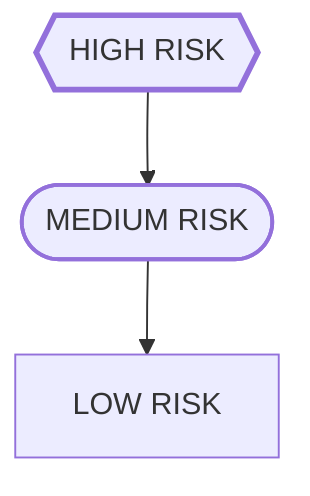

### 🔴 High Risk
Information that could cause financial, legal, compliance, or reputational harm if incorrect.
- Education award amount
- Legal compliance statements
- Biweekly stipend amount

### 🟡 Medium Risk
Information that impacts user planning but does not create legal exposure.
- Financial aid policies
- Application deadlines

### 🔵 Low Risk
- Cosmetic or brand-related issues with no operational impact.
